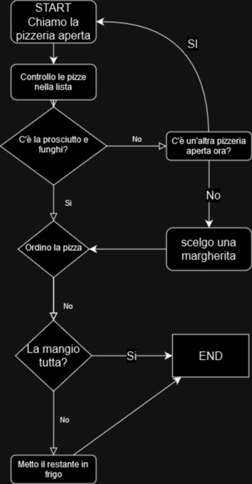

# HUMAN CODING

**`Descrizione:`**

Tu non hai fame?!

Dopo una lunga giornata passata al pc, ho proprio voglia di concedermi una bella pizza succulenta! Sì, ma quale? Fammi dare un occhio al listino… Va beh, è inutile, tanto alla fine ordino sempre la stessa: una classica prosciutto e funghi. La pizza arriva ancora fumante, chissà se riuscirò a mangiarla tutta!

Di sicuro se ne avanzo una fetta devo ricordarmi di metterla in frigo, non come l’ultima volta! 

​

### PROCEDIMENTO:

​

1. **START Chiamo la pizzeria aperta** 

2. **Controllo le pizze nella lista**

    - **`SE`** cè la pizza prosciutto e funghi:
        - vado al punto `3`
        
     - **`ALTRIMENTI`**    
        
        - C'è un'altra pizzeria aperta ora?
            - Si, torna al punto `1`
            - No, ordino una margherita
                - vado al punto `3`

3. **Ordino la pizza**

     - **`SE`** La mangio tutta
        - END

    - **`ALTRIMENTI`**
        - Metto la parte rimanente in frigo
        - END

-

                    

    

